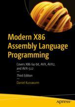

# Apress Source Code - Linux

This repository accompanies [*Modern X86 Assembly Language Programming - 3th edition*](https://link.springer.com/book/10.1007/978-1-4842-9603-5) by Daniel Kusswurm (Apress, 2023).

[comment]: #cover

This repository is moved to his own space [*Modern X86 Assembly Language Programming - Linux/Nasm*](https://github.com/agguro/modern-x86-assembly-language-programming-3e/tree/linux)
